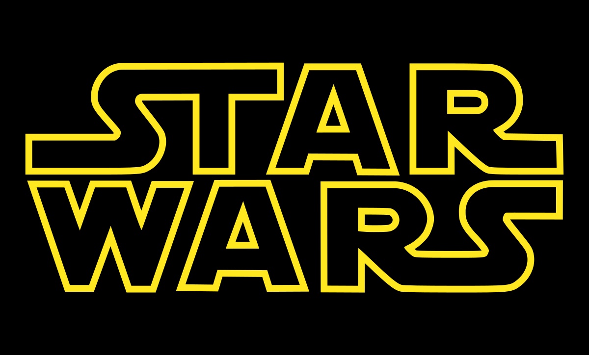

# Bem vindo ao repositório do projeto Star Wars Planets Search!

Este projeto se trata de uma aplicação FrontEnd desenvolvido com **React**. Seu proposito é mostrar uma tabela com os planetas do universo de Star Wars.
Com varios filtros e de facil entendimento.

# Tecnologias

Nesse projeto foi utilizado:

* Linguagem [JavaScript](https://developer.mozilla.org/pt-BR/docs/Web/JavaScript);
* Biblioteca [React](https://react.dev/);
* Estilização [CSS](https://developer.mozilla.org/pt-BR/docs/Web/CSS);
* Framework de Testes [Jest](https://jestjs.io/pt-BR/);

# Dados sobre o projeto

Este projeto não é de 100% autoria minha, parte deste foi desenvolvida pela [Trybe](https://www.betrybe.com/) os arquivos desenvolvidos por mim foram:

- ./src/components
- ./src/context
- ./src/hooks
- ./src/styles
- ./src/tests
- ./src/App.css
- ./src/App.js
- ./src/index.js
- ./src/index.css

Os demais arquivos faram desenvolvidos pela Trybe.
